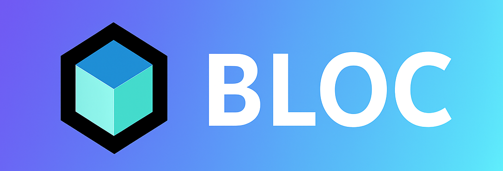

# 💫 About Me:
## About Me  👨‍💻 Who I Am   I’m Rony, an innovative and detail-oriented Flutter Developer  🚀 Expertise   Flutter, Dart, BLoC & Provider state management  🛠️ Principles   Clean code & clean architecture  🤝 Collaboration   Working with cross-functional teams to build scalable, maintainable solutions  😄 Passion   Crafting engaging mobile experiences that drive business value and delight users  🎉 Let’s build something amazing together!

## 🌐 Socials:

# 💻 Tech Stack:
 
 

 

 
 
 

### ❛❛ ❜❜ Random Dev Quote

